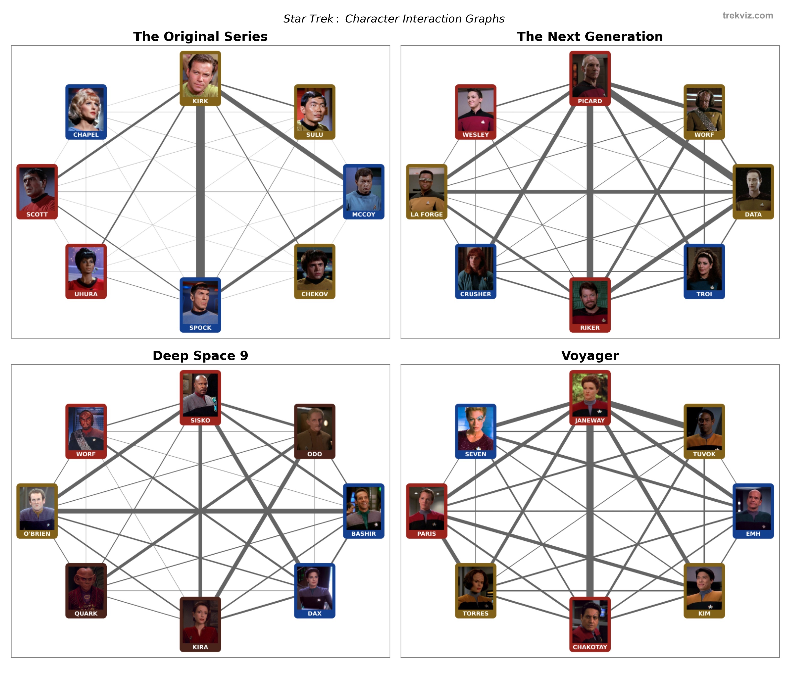

## TREKVIZ

Dashboard used to visualise how many lines and interactions characters have in the different Star Trek series. You can [view it here](https://gmorinan-trekviz-app-d7h5oq.streamlit.app) (hosting provided by Streamlit).

To run this locally:
```
streamlit run app.py
```

Main libraries used are: [Streamlit](https://streamlit.io/), [Altair](https://altair-viz.github.io/), [Networkx](https://networkx.org/) & [Pyvis](https://pyvis.readthedocs.io/en/latest/)

#### NOTES 
* Interactions = the number of consecutive lines the two characters shared.
* Transcripts of episodes were used, hence "Episode Number" is actually transcript number.
* Some transcripts covered 2-parters, hence why there are less transcripts that aired episodes.
* Recent series (Discovery, Picard, Lower Decks) are not included due to lack of online transcripts. 


### GRAPHS WITH THUMBNAILS

* ```/thumbnails``` contains images for each character.
* ```/interactions``` contains HTML interaction graphs, made using Pyvis, that use these images for each character node (note these use relative path references, so if you move the files around everything will stop working).
* However, at the time of writing, HMTL files displayed within Streamlit cannot read and display images. Hence the interaction graphs in ```app.py``` just use character names.
* And for ease of transport a JPG summary is included in this repo:




## ABOUT

Author details: [profile](https://www.linkedin.com/in/gmorinan/) , [words](https://medium.com/@g.morinan)

Transcripts source: [chakoteya.net](http://www.chakoteya.net/)

Thumbnails source: [memory-alpha.fandom.com](https://memory-alpha.fandom.com/)

StarTrek rights owner: [ViacomCBS](https://www.viacomcbs.com/)


